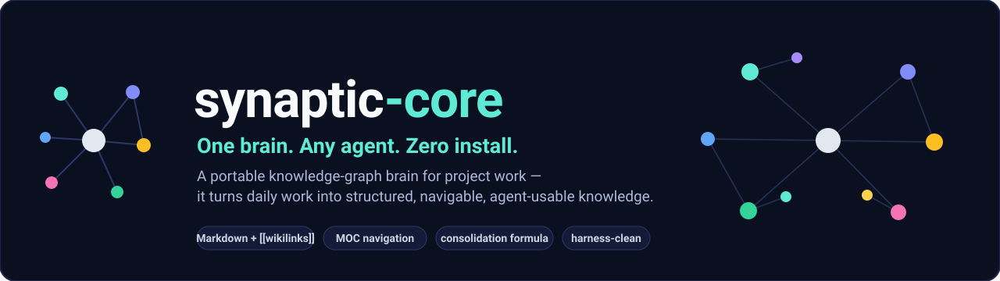
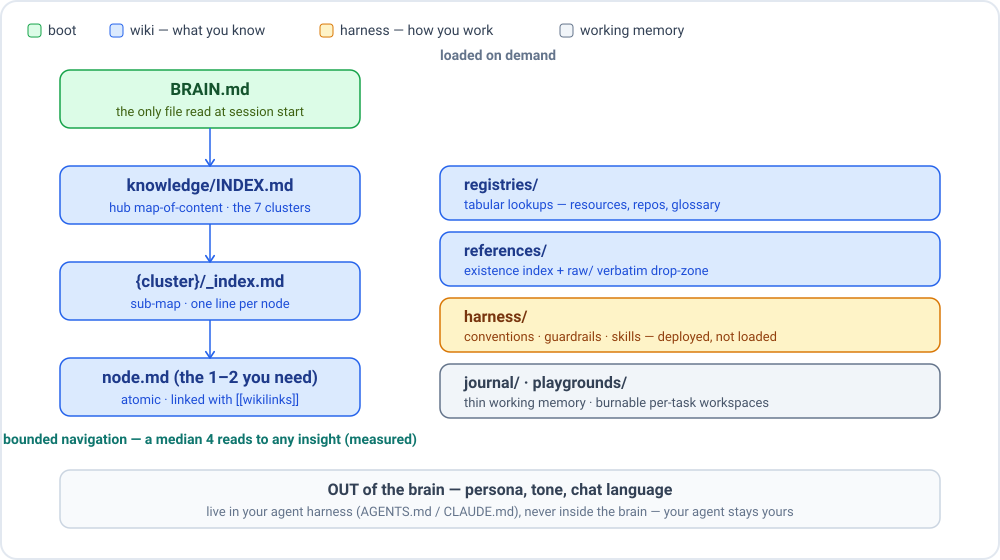

<p align="center">
  
</p>

<p align="center">
  
  
  
  
  
</p>

<p align="center"><strong>One boot file. Any agent. No required installations.</strong></p>

Synaptic turns daily work into structured, navigable, agent-usable knowledge — a brain any agent can pick up in seconds and that travels with you when the project ends. The differentiator: instead of dumping context somewhere, you curate it once (write-time), so every future agent session reads cheap and deterministic. No re-briefing. No tribal knowledge walking out the door.

---

## 🚀 Quick start (60 seconds)

**Recommended — install the skill:**

```
# Claude Code / VS Code Copilot / OpenCode
.claude/skills/synaptic/SKILL.md

# Gemini CLI / Codex / universal fallback
.agents/skills/synaptic/SKILL.md
```

Copy [`standalone/synaptic/SKILL.md`](standalone/synaptic/SKILL.md) into either path above, then tell your agent:

```
/synaptic-init
```

The skill runs a scope-aware interview, generates a complete personalized brain, and self-wires your harness (writes `AGENTS.md` / `CLAUDE.md` fragment, installs skill in both paths). No further steps.

**Advanced — drop the seed:**

Copy [`seed/.synaptic/`](seed/.synaptic/) into your project root. Fill every `{{placeholder}}` in `BRAIN.md`, then tell your agent: `"Read .synaptic/BRAIN.md and follow it."` See the [seed flow details](#) below.

**Upgrading from v0.3 / v0.4 / v0.5:**

```
/synaptic-upgrade
```

Two-engine migration: deterministic file ops (Phase M) + mandatory agent rearrange (Phase C). See [migration details](#) in the collapsible section below.

**Skill-less fallback (any agent, always works):**

> Paste `"Read .synaptic/BRAIN.md and follow it."` — the brain is self-describing. You lose the guided lifecycle commands; the brain works.

---

## 🧠 How it works

<p align="center">
  
</p>

One boot file (`BRAIN.md`, ≤110 lines, ~500 tokens) is the only mandatory read. It carries the context capsule, the capture contract, a 1-line pointer to the deployed harness rules, the brain map, and the session-start pointer. Everything else loads on demand.

Navigation is bounded at ~3–4 hops regardless of brain size — you never read 10 files to get one insight:

```
BRAIN.md (boot)
  → knowledge/INDEX.md        (hub MOC: 1-line per cluster)
    → {cluster}/_index.md     (sub-MOC: 1-line per node)
      → open only the 1–2 relevant nodes
```

The brain has **two planes** — wiki (what you know) and harness (how you work here) — and one explicit out-of-scope: **persona lives in your agent harness, not the brain**. Your Jarvis stays Jarvis. The brain travels.

---

## ✨ Features

| Feature | What it gives you |
|---|---|
| **MOC-of-MOCs navigation** | Bounded ~3–4 hops to any insight, regardless of brain size |
| **Consolidation formula (6 steps)** | Agent-agnostic algorithm in every `BRAIN.md`; brain grows correctly on its own |
| **Registries** | Tabular SSOTs for records looked up by attribute (infra, repos, environments, glossary) |
| **Harness as deploy-source** | `/synaptic-init` and `/synaptic-upgrade` regenerate your harness from the brain on any machine |
| **Playgrounds** | Per-task workspaces — burnable, registered in journal, never polluting knowledge |
| **Opens in Obsidian / Foam / Logseq** | `[[wikilinks]]` + YAML frontmatter are native; graph view renders immediately, no conversion |

> **Internal, single-run benchmark** (real ~60-file brain; efficiency + coverage measurement, not ground-truth accuracy): median ~4 file-reads per question answered; 17/18 questions resolved by the INDEX hierarchy alone without falling back to grep. One data point — shared for orientation, not as a performance claim.

---

## 👤 Value by audience

**For people — your second brain**

Stop re-briefing your agent every session. Your accumulated knowledge is yours: portable, readable without any tool, never locked to a service. Hand over a role with something real — not a dump of meeting notes. Knowledge compounds: every session adds to the graph.

**For projects — an agent that onboards in seconds**

An agent reads one file and already knows the scope, conventions, guardrails, and where everything lives — before writing a single line. Decisions, patterns, and playbooks accumulate through real work. No re-briefing between sessions; no tribal-knowledge dependency.

**For companies — knowledge continuity without a platform rollout**

A contractor finishes; their successor reads `.synaptic/BRAIN.md` and picks up where they left off. No new platform to procure, no rollout project, no vendor dependency. Auditable by default: compliance can read every file. Works on-premise, air-gapped, or in any cloud.

---

## 🧬 Built on proven ideas (and why)

Synaptic-core did not invent its substrate — it converged on patterns that the PKM and agent-skills community had already validated, then applied a specific **direction**: purpose-built to accrete a role's knowledge and encode the explicit formula (intention + inertia) that makes it grow correctly. The value-add is that direction, not the format. See also [Acknowledgments](#acknowledgments) for project-level credits.

| Technique / source | How synaptic-core uses it | Why it fits an agent-read brain |
|---|---|---|
| **Atomic notes — Zettelkasten / Luhmann** | One concept per node, kebab-case filename (`auth-model.md`), ~150-line soft budget; consolidation formula enforces "promote only when it recurs" | Precise retrieval: the filename IS the concept; composable links work because scope is bounded. Over-atomization is deliberately avoided — agents handle dense pages better than ten micro-files. |
| **Maps of Content / MOC-of-MOCs — Obsidian / Nick Milo** | Three-level hierarchy: `BRAIN.md` → `knowledge/INDEX.md` (hub MOC, 1-line per cluster) → `{cluster}/_index.md` (sub-MOC, 1-line per node) → open only 1–2 nodes | Bounded navigation: ~3–4 hops to any insight regardless of brain size. The 1-line summaries in `_index.md` are the mechanism — an agent reads the summary, not the full node, to decide whether to open it. |
| **Bidirectional `[[wikilinks]]` — wiki / Obsidian** | Every node uses `[[page-name]]` links written at capture time; backlinks resolved via `grep -r "[[node]]"` (CORE) or the FTS5 index (horizon ROBUST); opens natively in Obsidian / Foam / Logseq | Emergent link-graph: structure comes from links, not rigid folder hierarchy. A concept can belong to multiple clusters simultaneously. Multi-dimensional without duplication. |
| **LLM-wiki / "compile knowledge" — Karpathy** | Curated narrative pages an agent reasons over whole (no chunking); `references/raw/` holds verbatim payloads as schema-on-read fallback; consolidation formula = write-time curation discipline | Curate once, read cheap forever. Agents re-read the same context constantly; schema-on-write means retrieval is near-deterministic. Coherent curated context beats reassembled chunks for reliability and auditability. |
| **Progressive disclosure — Anthropic Agent Skills** | `BRAIN.md` (≤110 lines, ~500 tokens) is the only boot read; skill metadata surfaces in Level 1 (~100 tokens); full skill body loads on trigger; reference files and seed templates load only at brain-init | Token economy: awareness costs ~100 tokens per skill; full depth costs only when needed. The same principle governs the brain: one boot file, everything else on demand. |
| **Frontmatter + tags — PKM metadata standard** | Every node carries `description`, `type`, `status`, `updated`, `tags` (D1 decision, SPEC §4.3); `description` feeds the `_index.md` 1-liner and any future embedding input | Machine-readable surface for `/synaptic-audit`, `Ctrl+Shift+F` faceted search, and future FTS / semantic search — without forking the format when those layers are added. |
| **Explicit contribution protocol — spec-driven mindset** | The 6-step consolidation formula (classify → atomicity test → generalize → place & link → dedupe/SSOT → quality gate) is embedded in every `BRAIN.md` as the capture contract | Agent-agnostic, consistent: any agent that runs this formula produces a navigable graph, not a pile of notes. The formula encodes both intention (what belongs) and inertia (how it grows). |
| **Files-authoritative / local-first — Engram-inspired governance** | Files are the single source of truth; agent-native memory (Claude Code auto-memory, etc.) is treated as a cache; tools (`check`, `migrate`, `export`) are derived readers, never writers of truth | Portable, auditable, git-native. The brain works on a locked-down laptop, air-gapped server, or any future agent platform. No runtime dependency can become a single point of failure. |

**On the horizon — deliberately NOT in CORE:**

| Technique | Why it is a horizon item, not CORE |
|---|---|
| **GraphRAG / semantic-nugget retrieval** (Microsoft GraphRAG, LightRAG) | Curated wikilink pages already give coherent retrieval for agent-authored brains; a full LLM-per-chunk indexing pipeline is over-engineering for CORE and cost-justified only for unstructured corpus ingestion. On the ROADMAP as an optional ECOSYSTEM layer. |
| **SQLite/FTS5 sidecar** (Engram-style) | FTS5 adds O(log n) backlink resolution and conflict detection — genuine value at scale — but it is a derived, deletable index over the files, not a replacement. Incompatible with the zero-install CORE constraint. On the ROADMAP as ROBUST mode. |

> These horizon items are enabled by the v1 file contract (frontmatter + tags + INDEX + `[[wikilinks]]`) — they attach without forking the format.

---

## 🔧 Commands

| Command | What it does |
|---|---|
| `/synaptic-init` | Scope-aware interview; generates brain; self-wires harness; can import a context-pack seed |
| `/synaptic-consolidate` | Run the 6-step capture contract on current session output |
| `/synaptic-ingest [file]` | Distil a document into an atomic node + reference entry |
| `/synaptic-audit` | Check for orphans, broken links, stale nodes, MOC coverage, registry/reference integrity, tag hygiene |
| `/synaptic-upgrade` | Migrate a v0.3 / v0.4 / v0.5 brain to v1 (interactive, two-engine) |
| `/synaptic-weave` | Retroactive graph-gardening: missing links, near-duplicates, theme promotion |

---

## 🤝 Plays well with others

| Tool / pattern | Relationship |
|---|---|
| **gentle-ai / ai-rules-sync / block/ai-rules / rulesync** | Harness wiring and cross-agent sync — install the skill in standard paths; these tools pick it up automatically |
| **Engram** | Robust memory horizon: SQLite + FTS5 sidecar over the brain. Files stay authoritative; Engram is a derived cache |
| **Smart Connections / SQLite-vec / RAG stacks** | Semantic search horizon: the v1 frontmatter + tags + INDEX + wikilinks contract is the indexable surface — attaches without forking the format |
| **Jira / Trello / MCP task systems** | Tasks live there. The brain documents context and decisions; it does not track tickets |
| **Agent-native memory** (Claude Code auto-memory, Copilot Memory) | Useful within its harness; treated as cache. Files win when they conflict |

---

## ⚠️ What SYNAPTIC-CORE is NOT

- **Not a task manager** — tasks, backlog, and roadmap belong in Jira, Linear, Trello, or your MCP task system
- **Not an agent framework** — it does not replace AGENTS.md, CLAUDE.md, or tool configs; those configure the agent; Synaptic configures what the agent *knows*
- **Not a persona configurator** — no identity directory, no per-brain behavior config; persona lives in your harness, not the brain
- **Not a database** — no queries, no schemas, no server; just files
- **Not another platform to roll out** — it is a folder of Markdown files; it works with what you already have
- **Not domain-specific** — SYNAPTIC-CORE is a structure; your brain is yours to fill

---

## 📏 Consolidation discipline is the product

The brain does not grow on its own. Without the capture contract being run, you have a note-dump. With it, you have a compounding brain.

This is the honest trade: **you pay ~5–10 minutes per active session** to run `/synaptic-consolidate` (classify, generalize, link, gate). In exchange, you erase the re-briefing tax on every future session, the onboarding tax for every new teammate or agent, and the handover tax when the project ends. Not "zero overhead." A deliberate trade of write-time cost for read-time leverage.

| When | Action |
|---|---|
| **Every session end** | Run `/synaptic-consolidate` — apply the 6-step capture contract to what was produced |
| **Weekly** | Run `/synaptic-audit` — surface orphans, broken links, stale nodes, MOC gaps |
| **Monthly** | Run `/synaptic-weave` — retroactive graph-gardening: missing links, near-duplicates, theme promotion |

Without this cadence the brain drifts. With it, quality compounds.

> **Tip:** see [`recipes/session-end-consolidate.md`](recipes/session-end-consolidate.md) for an optional Claude Code `settings.json` hook that reminds you to consolidate when the session changes `journal/` or `playgrounds/`.

---

<details>
<summary>The two-plane model (knowledge · operating rules · persona)</summary>

A `.synaptic/` brain has exactly **two planes** and one explicit out-of-scope:

| Plane | Holds | Test | Load |
|---|---|---|---|
| **Wiki** (`knowledge/`, `registries/`, `references/`) | What you **know**: patterns, decisions, playbooks, lessons, lookup tables, external references | "Does the agent *reason over* it?" | On demand via MOC |
| **Harness** (`harness/`) | How you **work here**: conventions, guardrails, project-local skills (e.g. a Jira CLI) | "Does the agent *obey or execute* it?" | Compressed subset in BRAIN.md; full depth on demand |
| **OUT — user harness** | Persona, tone, chat-language preference, agent personality | "Is it about how the agent treats *you*?" | Not in the brain at all |

The **only mandatory read** is `BRAIN.md` — one file, target ≤110 lines, ~500 tokens. It carries the context capsule, the capture contract, a 1-line pointer to the deployed harness rules, the brain map, and the session-start pointer. Everything else loads on demand when the agent has a reason to need it.

Three concerns are explicitly separated and never mixed:

- **Knowledge** lives in the brain (`knowledge/`, `registries/`, `references/`) and is read on demand via MOC.
- **Operating rules** (commit conventions, guardrails, project skills) live in `harness/` as a **deployable source**: `/synaptic-init` and `/synaptic-upgrade` deploy them into the outer harness (AGENTS.md / CLAUDE.md); at work-time the agent reads the outer harness, not the brain's `harness/` folder. The brain keeps the copy so the harness is regenerable on any machine.
- **Persona** (tone, chat language, agent personality) lives in the outer harness only — never in the brain.

The brain stays knowledge-focused; the harness stays rule-focused; portability is preserved. A Jarvis-persona agent and a vanilla agent share the same brain without conflict.

**Your Jarvis stays Jarvis. The brain travels.**

</details>

<details>
<summary>The consolidation formula (6 steps)</summary>

The **capture contract** (embedded in every `BRAIN.md`) is a six-step agent-agnostic algorithm. Any agent that runs this formula produces a navigable graph — not a pile of notes.

1. **Classify** — durable knowledge · tabular record → registry · lesson · decision · big task → playground · temporal → journal · noise → drop
2. **Atomicity test** — promote only when it recurs (2+ instances → pattern) or is a reusable decision/lesson; incident-specifics stay in playground/journal
3. **Generalize** — strip the anecdote, keep the reusable pattern; name = the concept, not the ticket
4. **Place & link** — atomic node in the right cluster; D1 frontmatter; `[[wikilinks]]`; register in cluster `_index.md`
5. **Dedupe / SSOT** — search first; update, don't duplicate; one source of truth per fact
6. **Quality gate** — professional & verifiable only; soft budget ~150 lines or tag `type: reference`; stamp `updated:`; confirm reachable from a MOC

This formula runs after every session via `/synaptic-consolidate`. It is what makes the brain accrete *correctly*.

</details>

<details>
<summary>Write-time curation vs read-time RAG — and why we curate</summary>

There are two schools of AI knowledge management, split by where the reasoning work happens:

- **Write-time curation (schema-on-write):** raw information is consolidated into curated, linked pages once, on the way in. Retrieval is then cheap and near-deterministic — read the right page, get a coherent answer. Auditable, portable, stable across agents and sessions. The consolidation formula is the cost; you pay it once per insight, not once per query.
- **Read-time RAG over raw (schema-on-read):** store raw artifacts verbatim, chunk and embed them, then retrieve and reason on every query. Fast to start, loses no raw detail — but reasoning cost is paid on every read, answers are re-derived rather than stable, and the result is not human-navigable or portable.

We chose write-time curation because agents re-read the same context constantly: curate once, read cheap forever. Curated knowledge is also auditable (a teammate or any new agent gets the same coherent page, not a fresh re-derivation) and portable (pure Markdown, no runtime dependency).

We are in practice a **pragmatic hybrid**: the wiki is schema-on-write, and verbatim payloads are kept in `references/raw/` as a schema-on-read fallback for the rare fine-detail query. Best of both: coherent reads by default, raw available when needed.

</details>

<details>
<summary>Matrioshka architecture (CORE · TOOLS · ECOSYSTEM)</summary>

Each inner layer is independent of the outer ones:

```
  ┌──────────────────────────────────┐
  │           ECOSYSTEM              │
  │  MCP server, RAG, Engram,        │
  │  semantic search (horizon)       │
  │  ┌────────────────────────┐      │
  │  │        TOOLS           │      │
  │  │  check · migrate       │      │
  │  │  export · vault-open   │      │
  │  │  graph                 │      │
  │  │  (Node ≥ 18, optional) │      │
  │  │  ┌──────────────────┐  │      │
  │  │  │      CORE        │  │      │
  │  │  │  Pure Markdown   │  │      │
  │  │  │  Zero deps       │  │      │
  │  │  └──────────────────┘  │      │
  │  └────────────────────────┘      │
  └──────────────────────────────────┘
```

**CORE** works everywhere, always — even on an air-gapped corporate laptop with nothing installed. **TOOLS** and **ECOSYSTEM** are optional power-ups. Removing the outer layers does not break the inner ones.

- **CORE:** Pure Markdown + YAML, zero dependencies, works everywhere including air-gapped corporate environments
- **TOOLS** (optional, zero-dep, Node ≥ 18): `check`, `migrate`, `export`, `vault-open`, `graph` — the happy path for the ~90% of users who have a runtime
- **ECOSYSTEM** (horizon): MCP server, semantic search / RAG, shared team brain, Engram-style SQLite/FTS5 sidecar

</details>

<details>
<summary>Full directory layout</summary>

```
.synaptic/
├── BRAIN.md                   # The only boot file: context capsule + capture contract + 1-line harness pointer + brain map
├── knowledge/                 # WIKI — what you know
│   ├── INDEX.md               # Hub MOC: lists clusters + 1-line summary each
│   ├── {cluster}/             # Domain or area (e.g. infrastructure/, customer-feedback/)
│   │   ├── _index.md          # Sub-MOC: 1-line summary per node
│   │   └── {node}.md          # Atomic node — type: knowledge|pattern|playbook|decision|lesson|reference
│   └── lessons/               # type: lesson (dated)
├── registries/                # Tabular SSOTs: resources, repos, db-servers, environments, glossary
├── references/                # Existence index (_index.md) + raw/ verbatim drop-zone (DDL, specs, exports)
├── harness/                   # HARNESS — how you work here (depth-on-demand)
│   ├── conventions.md         # Working agreements: languages per channel, commit style, etiquette
│   ├── guardrails.md          # Hard rules: security, never-push-without-confirm, runner discipline
│   └── skills/                # Project-local executable skills — travel with the brain
├── playgrounds/               # Per-task workspaces {task-id}/ — fat, burnable; registered in journal
├── journal/_current.md        # Thin working memory: resume anchor / watch list / consolidation log (≤80 lines)
└── templates/                 # Node, registry, playbook, lesson templates
```

Repository structure:

```
synaptic-core/
├── seed/              # Reference brain skeleton — the v1 .synaptic/ seed
├── standalone/        # The synaptic skill package (installable without the full repo)
├── docs/              # Architecture decisions (ADR-001, ADR-002, ...) + assets
└── tools/             # Optional TOOLS layer (check, migrate, export, vault-open, graph)
```

</details>

<details>
<summary>Optional tooling (check · migrate · export · vault-open · graph)</summary>

All tools are **zero-dependency** (Node ≥ 18 standard library only). CORE never requires them. When no runtime is available, the `synaptic` skill instructs the agent to perform the equivalent operation manually.

| Tool | Command | What it does |
|---|---|---|
| `check` | `node tools/check.js [.synaptic]` | Graph health: broken `[[wikilinks]]`, MOC coverage, frontmatter, soft budgets (warn), registry/reference integrity, orphan nodes |
| `migrate` | `node tools/migrate.js <.synaptic> [templates-dir] [--dry-run]` | Automates Phase M of a v0.x → v1 upgrade (deterministic, idempotent, non-destructive) |
| `export` | `node tools/export.js <.synaptic> [out.md]` | Bundles the entire brain into a single portable Markdown file (or `--split` into 4 sections) |
| `vault-open` | `node tools/vault-open.js <.synaptic>` | Writes minimal optional config for Obsidian, Foam, and Logseq; produces `OPEN-IN.md` |
| `graph` | `node tools/graph.js [.synaptic] [--out FILE] [--format html\|svg]` | Render a visual graph image of your brain — executive-friendly, no install; deterministic layout makes before/after states visually comparable |

**Opens in your tools without any conversion:**

| Tool | How to open | Notes |
|---|---|---|
| **Obsidian** | Open project folder as a vault | `[[wikilinks]]` and YAML frontmatter are native; graph view renders immediately |
| **Foam (VS Code)** | Install Foam extension; open workspace | Wikilinks, backlinks, and graph panel work out of the box |
| **Logseq** | Open project folder as a graph | Switch to Markdown mode; Logseq journals disabled in favour of `journal/_current.md` |

`tools/vault-open.js` (optional, zero-dep) writes minimal config for each tool and produces `OPEN-IN.md` at the brain root. If you prefer to skip it, just open the folder — it works.

</details>

<details>
<summary>Design philosophy</summary>

The core thesis: a non-invasive pattern that turns daily work into **structured, auditable, transferable, agent-usable knowledge** — reducing the delivery "knowledge tax" (onboarding, handovers, context reconstruction, documentation drift, tribal-knowledge dependency) without requiring a platform, a budget, or a security exception.

The principles:

- **0-install-capable CORE** — tools are optional; the brain works with just files
- **Files authoritative** — agent-native memory is a cache; the source of truth never moves
- **Harness-clean** — persona and behavior belong in the harness; the brain travels without them
- **Single boot file** — one mandatory read at session start; everything else on demand
- **Human-readable** — every file is Markdown or YAML; auditable, printable, editable without a tool
- **Agent-agnostic** — any agent that can read files can use a Synaptic brain

</details>

---

## 🗺️ Further reading

- [ROADMAP.md](ROADMAP.md) — what shipped in v1.0 and the honest platform-mode horizon (MCP server, semantic search, team brain, Engram-style sidecar)
- [PITCH.md](PITCH.md) — the two-tier value framing; Tier 2 covers the technical foundations in depth

---

## Acknowledgments

- **[Arscontexta](https://github.com/agenticnotetaking/arscontexta)** — The write-validation gate and discovery-first quality gate are directly inspired by Arscontexta's domain-derived patterns.
- **[GSD (Get Shit Done)](https://github.com/gsd-build/get-shit-done)** — GSD excels at planning and execution; Synaptic excels at memory and knowledge. They complement each other.
- **[ClawVault](https://github.com/ClawVault/ClawVault)** — The wake/sleep lifecycle pattern influenced the session rhythm and journal design.
- **[Roam-Code](https://github.com/roam-code/roam-code)** — Multi-platform config detection shaped the `/synaptic-init` harness self-wire step.
- **[skills.sh / agentskills.io](https://agentskills.io)** — The `synaptic` skill package follows the Agent Skills progressive-disclosure format.
- **Zettelkasten / LLM-wiki convergence** — The MOC-of-MOCs navigation and atomic node model follow the Zettelkasten principle (links are the structure; folders are optional organisation) as validated by Karpathy's LLM-wiki work and the llmwiki.app pattern: dense, linked, agent-navigable pages over shallow bullet hierarchies.

We believe in synergy over competition. SYNAPTIC-CORE is a knowledge standard, not an everything-toolkit.

---

## Contributing

Bug reports, edge cases, example brains for different domains, improvements to the spec, ECOSYSTEM plugins — open an issue or submit a PR. The standard is young and actively evolving.

---

## License

MIT — Use it, fork it, improve it, share it.
