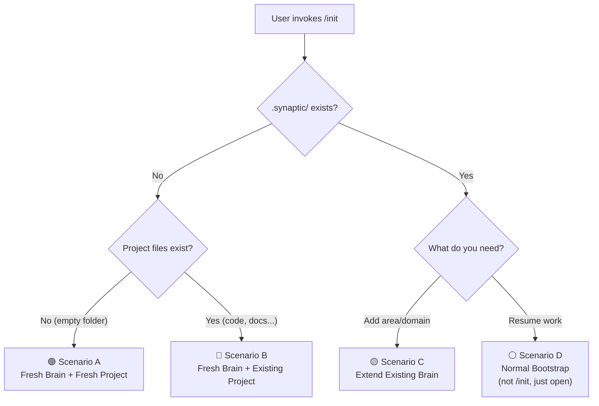

# SYNAPTIC-CORE: Architecture Synthesis & Recommendation (v4 — Final)

> *"Un estándar abierto para cerebros portables de IA — manuales de instrucciones que cualquier agente puede asimilar y cualquier humano puede leer."*

---

## 1. The Problem

Context is fragmented across conversation UIs, IDE agents, and ad-hoc files — no portable, structured system to unify, persist, and share knowledge.

## 2. What SYNAPTIC-CORE Is

A **file-based standard** for portable AI brains: vendor-agnostic, Markdown-first, zero-install, copyable between devices/people/projects, enhanceable when the environment allows.

**Not** a replacement for agent-native memory — a **shared layer on top** that survives across tools, sessions, and people.

---

## 3. The Matrioshka Architecture

```
         ┌──────────────────────────────────────────────┐
         │           🌐 ECOSYSTEM                       │
         │   Independent plugins, each its own repo.    │
         │   MCP · Vector Search · Obsidian · GUI ...   │
         │                                              │
         │     ┌──────────────────────────────────┐     │
         │     │        🔧 TOOLS                  │     │
         │     │   Automation scripts bundled      │     │
         │     │   in the brain. Agent bootstraps  │     │
         │     │   them when runtime is detected.  │     │
         │     │                                   │     │
         │     │     ┌───────────────────────┐     │     │
         │     │     │     🧠 CORE            │     │     │
         │     │     │                       │     │     │
         │     │     │  Pure files.          │     │     │
         │     │     │  The standard.        │     │     │
         │     │     │  Zero installs.       │     │     │
         │     │     │  Always works.        │     │     │
         │     │     └───────────────────────┘     │     │
         │     └──────────────────────────────────┘     │
         └──────────────────────────────────────────────┘
```

| Layer | What | Requirements |
|-------|------|-------------|
| **🧠 CORE** | The spec. Pure Markdown + YAML index. Bootstrap. Consolidation via skill prompts. | Nothing. Copy the folder. |
| **🔧 TOOLS** | Automation scripts inside the brain. Agent detects runtime and uses them for deterministic ops. | node/python (agent bootstraps) |
| **🌐 ECOSYSTEM** | Independent plugins, each its own repo. Installed as skills into the brain. | Varies per plugin |

### Why Tools Isn't a Separate "Mode"

Capability detection lives in `BOOTSTRAP.md` (CORE layer):

```markdown
## Step 0: Detect Capabilities
1. Can you execute `node --version`? → tools:node available
2. Can you execute `python --version`? → tools:python available
3. Neither → pure file mode (all via prompts)
4. If tools available → suggest activating synaptic-tools
```

This always runs in CORE. If runtime is detected, the agent can suggest installing `synaptic-tools` scripts. If not, everything works — just with more token consumption.

**Token savings with Tools:**

| Operation | CORE only | With TOOLS |
|-----------|----------|------------|
| Rebuild `_tree.yaml` | ~5K tokens | 0 tokens (instant) |
| Validate budgets | ~2K tokens | 0 tokens (exact) |
| File operations in consolidation | ~3K tokens, error-prone | 0 tokens, deterministic |

### Repository Structure

```
synaptic-core/          # 🧠 The specification + templates + built-in skills
synaptic-tools/         # 🔧 Automation scripts + runtime adapters
synaptic-*-plugin/      # 🌐 Each plugin is its own repo
```

> [!NOTE]
> **On the Ecosystem**: Plugins are independent repos following a plugin convention defined in CORE. No monolithic "ecosystem repo". In the future, a **Synaptic Suite** could be a curated bundle of official plugins (GUI + Obsidian + MCP) as a standalone product — with potential monetization.

### On Connectors

Direct programmatic connectors to read/write the brain are **redundant when an agent is present** — the agent IS the connector. Connectors would only matter for agent-less integrations (CI/CD pipelines, dashboards). Not needed for MVP; revisit if the ecosystem demands it.

### On Proactive Script Suggestion (Future)

The Tools layer can evolve to detect repetitive patterns in user tasks and **proactively suggest automation scripts**. These user scripts would live **outside the brain** (in the project workspace), not inside `.synaptic/`. The brain's job is knowledge, not user automation — but TOOLS can be the catalyst that identifies and proposes them.

---

## 4. CORE — The Standard

### Directory Structure

```
.synaptic/                          # The "brain" — copy to transfer knowledge
├── MANIFEST.md                     # Brain metadata, version, capabilities
├── BOOTSTRAP.md                    # "Read me first" — agent init protocol
│
├── identity/                       # WHO
│   ├── ROLE.md                     # Role, expertise, communication style
│   ├── PRINCIPLES.md               # Decision-making constraints
│   └── CONTACTS.md                 # People & stakeholders directory
│
├── knowledge/                      # WHAT
│   ├── INDEX.md                    # Human-readable knowledge map
│   ├── _tree.yaml                  # Agent-optimized tree index (auto-gen)
│   │
│   ├── areas/                      # WHERE you work (products/tools)
│   │   ├── [area-name]/            # e.g. "customer-feedback", "analytics"
│   │   │   ├── _overview.md        # Area summary + context
│   │   │   └── [topic].md          # Area-specific knowledge
│   │   └── ...
│   │
│   ├── domains/                    # Cross-cutting knowledge by topic
│   │   ├── [domain-name]/          # e.g. "architecture", "processes"
│   │   │   ├── _overview.md        # Domain summary + navigation
│   │   │   └── [topic].md          # Specific knowledge node
│   │   └── ...
│   │
│   └── lessons/                    # Post-task learnings
│       ├── _overview.md
│       └── [date-topic].md
│
├── inventory/                      # THINGS: concrete data & refs
│   ├── projects.md
│   ├── environments.md
│   └── glossary.md
│
├── references/                     # VERBATIM: files agent needs as-is
│   ├── _index.md                   # What's here and when to consult it
│   └── [schema.ddl, spec.yaml...] # Raw files
│
├── journal/                        # WHEN: session working memory
│   ├── _current.md                 # Active capture (→ consolidate)
│   └── archive/
│
├── skills/                         # HOW: built-in capabilities
│   ├── init/SKILL.md               # Brain setup (fresh or existing project)
│   ├── consolidate/SKILL.md        # Knowledge consolidation
│   └── ingest/SKILL.md             # Document ingestion
│
└── tools/                          # 🔧 Optional automation (agent-bootstrapped)
    ├── build-tree.js
    ├── validate.js
    └── consolidate-files.js
```

> [!TIP]
> All node names under `areas/` and `domains/` are **illustrative examples**. Users create whatever areas/domains match their work. The brain is a blank canvas with structure, not prescribed content.

### Areas vs Domains

```
areas/   = WHERE you work  → products, tools, projects you touch daily
domains/ = WHAT you know   → cross-cutting patterns, processes, conventions
```

### References — For DDLs, Schemas, Specs

Files stored **verbatim**. The `ingest` skill extracts a knowledge node (summary + key facts) into `domains/` for reasoning-based navigation. The original stays for exact lookups.

### Journal Scope — Only What's Portable

| ✅ Goes in journal | ❌ Does NOT |
|-------------------|------------|
| Decisions made | Intermediate reasoning |
| New inventory (IDs, URLs) | Debug output |
| Lessons learned | Agent-managed session state |

**Litmus test:** *"Lost if I switch agents?"* → journal. Otherwise → agent's own RAG.

### Bootstrap Protocol (🔵 Orient Phase)

1. Read `BOOTSTRAP.md` → init instructions + routing tree + warnings
2. Read `MANIFEST.md` → version, areas, capabilities
3. Detect capabilities → runtime available?
4. Read `ROLE.md` → adopt identity
5. Read `_tree.yaml` → knowledge map (summaries only)
6. Check `_current.md` → resume last session
7. **Ready** — ~600 lines loaded, zero full-content files

### Session Rhythm: Orient → Work → Persist

> Adopted from Arscontexta's session-rhythm kernel primitive (backed by Newport's closure rituals research).

| Phase | What the agent does | SYNAPTIC mapping |
|-------|-------------------|------------------|
| **🔵 Orient** | Load brain state, understand context | Bootstrap protocol (steps 1-7) |
| **🟢 Work** | Execute tasks, capture decisions/lessons | Write to `journal/_current.md` via routing tree |
| **🟠 Persist** | Update knowledge, prepare for next session | Run `/consolidate` or update `_current.md` with stop point |

`BOOTSTRAP.md` includes a session close section:
```markdown
## Session Close
Before ending a session:
1. If _current.md has actionable content → run /consolidate
2. Otherwise → update _current.md with where you stopped and what's pending
```

### Memory Routing Decision Tree

> Adopted from Arscontexta's three-space architecture. Embedded in `BOOTSTRAP.md`.

```
Is this about the brain's identity or methodology?
├── YES: Durable self-knowledge?
│   ├── YES → identity/ (role, principles, contacts)
│   └── NO → journal/_current.md
│
└── NO: Domain/project knowledge?
    ├── YES: Worth finding in a future session?
    │   ├── YES → knowledge/ (areas, domains, lessons)
    │   └── NO → journal/_current.md (may consolidate later)
    │
    └── NO: Concrete data (IDs, URLs, endpoints)?
        ├── YES → inventory/
        └── NO → Don't capture. Agent's own RAG handles it.
```

### Discovery-First Quality Gate

> Adopted from Arscontexta's discovery-first kernel primitive.

Before creating ANY knowledge node, the agent asks:

> **"How will a future agent, reading only `_tree.yaml`, find this?"**

Checklist (enforced in `consolidate/SKILL.md`):
- Title clearly describes the content
- Node appears in at least one `_overview.md`
- Node is reflected in `_tree.yaml` with a summary
- A new agent bootstrapping cold would know this exists

### Conflation Warnings

> Adopted from Arscontexta's six failure modes of conflation (top 3 most relevant).

`BOOTSTRAP.md` includes these guardrails:

1. **Ops → Notes**: If it's temporal ("today I did X"), it stays in `journal/`. Only durable decisions/lessons go to `knowledge/`.
2. **Notes → Ops**: If `_current.md` exceeds ~200 lines, proactively suggest `/consolidate`. Don't let insights get buried.
3. **Identity → Knowledge**: "I work best when..." → `identity/`. NOT `knowledge/domains/`. Use the routing tree.

### Size Budgets

| File | Max | Why |
|------|-----|-----|
| `BOOTSTRAP.md` | ~150 lines | Read once; includes routing tree + session rhythm + warnings |
| `_tree.yaml` | ~200 lines | Summaries only |
| `_overview.md` | ~50 lines | Navigation |
| Knowledge node | ~150 lines | Atomic |
| `_current.md` | ~200 lines | Consolidation trigger |

### Consolidation (🟠 Persist Phase)

Triggered via `/consolidate` or when `_current.md` exceeds budget:

1. **Extract** decisions, lessons, inventory from journal (LLM reasoning)
2. **Route** using the memory routing decision tree (LLM reasoning)
3. **Discovery-first check** — for each new node, verify it's findable via `_tree.yaml`
4. **File ops** — create/update `.md`, archive session (scripts or agent)
5. **Rebuild** `_tree.yaml` (scripts or agent)
6. **Clear** `_current.md`

---

## 4b. Setup Flow & Command System

### How "Commands" Work

The brain has **no command router, no CLI, no daemon**. Commands are just **skills** — prompt files that the agent reads and executes. The agent IS the runtime.

```
User says: "/init" or "initialize my brain" or "set up synaptic"
         ↓
Agent:   Reads skills/init/SKILL.md
         ↓
         Follows the dialogic setup protocol in the skill
         ↓
         Creates/fills all brain files
```

The `BOOTSTRAP.md` lists available commands:

```markdown
## Available Commands
- `/init` → Set up or extend the brain (skills/init/SKILL.md)
- `/consolidate` → Consolidate working memory into knowledge (skills/consolidate/SKILL.md)
- `/ingest [file]` → Ingest a document into the brain (skills/ingest/SKILL.md)
```

No routing logic needed. The agent reads the skill file and acts. Works on any agent platform.

### The Four Setup Scenarios



### Scenario A: Fresh Brain, Fresh Project

The simplest case. User starts from zero.

**Dialogic flow** (inspired by Arscontexta's setup interview):

```
Agent: "I'll set up your Synaptic brain. A few questions to understand your context:"

Q1: "What's your role? (e.g. 'Backend engineer at fintech startup')"
    → Writes identity/ROLE.md

Q2: "What are the main areas you work on? (products, tools, systems)"
    → Creates knowledge/areas/[name]/ for each

Q3: "Any key principles or constraints I should know?
     (e.g. 'Always use TypeScript', 'No external APIs without security review')"
    → Writes identity/PRINCIPLES.md

Q4: "Who are the key people you work with?"
    → Writes identity/CONTACTS.md (can be empty/minimal)

Q5: "Any existing documents, schemas, or specs you want me to ingest now?"
    → Runs /ingest for each → references/ + knowledge nodes

Agent: "Brain initialized. Here's what I created: [summary]"
       → Generates _tree.yaml, INDEX.md
       → Writes MANIFEST.md with timestamp
```

**Total: 3-5 questions, ~5 minutes.** Not 20 minutes like Arscontexta — we keep it fast.

### Scenario B: Fresh Brain, Existing Project 🔑

The critical case. User has code, docs, maybe even a `.agent/` folder with rules and skills.

**Workspace Scan** (validated by GSD's `map-codebase` pattern):

```
Agent detects project files exist:
  1. Scan workspace structure (top-level dirs, key files)
  2. Look for: README.md, package.json, .agent/, docs/, schemas, etc.
  3. Present findings: "I see a Node.js project with a Postgres schema
     and an existing .agent/ config. Want me to incorporate this context?"

If yes:
  → /ingest README.md → knowledge domain node
  → /ingest schema.ddl → references/ + knowledge node  
  → Read .agent/rules → incorporate into PRINCIPLES.md
  → Detect existing skills → note them in MANIFEST.md

Then: Normal dialogic flow (Q1-Q5) for what CAN'T be auto-detected
      (role, contacts, principles beyond what's in .agent/)
```

Key insight: **scan FIRST, ask SECOND**. Fill what can be auto-detected, then ask about gaps.

### Scenario C: Extend Existing Brain

User already has a `.synaptic/` brain but wants to add a new work area or domain.

```
User: "/init" (with .synaptic/ already present)

Agent: "Brain already exists (v1.0, 3 areas, 2 domains).
        What would you like to do?"
        
Options:
  a) Add a new work area → creates knowledge/areas/[name]/, asks context questions
  b) Add a new domain → creates knowledge/domains/[name]/
  c) Ingest new documents → runs /ingest
  d) Update identity → edits ROLE.md, PRINCIPLES.md, CONTACTS.md
  e) Re-scan workspace → looks for new project files to incorporate
```

### Scenario D: Normal Session Resume

This is NOT `/init` — it's just the agent opening a project that has `.synaptic/`. Governed by `BOOTSTRAP.md`:

```
Agent detects .synaptic/ → reads BOOTSTRAP.md → follows bootstrap protocol
→ Loaded and ready in ~500 lines, no setup questions
```

### Init Skill Design (skills/init/SKILL.md)

The init skill contains:
1. **Detection logic** — what to check to determine the scenario
2. **Scan protocol** — what project files to look for and how to interpret them
3. **Interview questions** — the dialogic setup, ordered by priority
4. **Templates** — what each generated file should contain
5. **Completion checklist** — what must exist before init is "done"

```markdown
## Completion Checklist
After /init, ALL of these must exist:
- [ ] MANIFEST.md (with version, timestamp, areas list)
- [ ] BOOTSTRAP.md (standard, not customized)
- [ ] identity/ROLE.md (at minimum role + expertise)
- [ ] identity/PRINCIPLES.md (can be minimal)
- [ ] knowledge/INDEX.md (even if sparse)
- [ ] knowledge/_tree.yaml (auto-generated)
- [ ] At least one area or domain with _overview.md
- [ ] journal/_current.md (empty, ready)
- [ ] skills/ with consolidate + ingest + init
```

---

## 5. Knowledge Flow

```mermaid
graph TD
    A[User + Agent Work] -->|Captures| B[journal/_current.md]
    B -->|Budget exceeded / manual| C[/consolidate]
    C --> D[knowledge/areas/]
    C --> E[knowledge/domains/]
    C --> F[inventory/]
    C --> G[knowledge/lessons/]
    C --> H[_tree.yaml rebuild]
    C --> I[journal/archive/]

    J[New Session] -->|Bootstrap| K[MANIFEST + ROLE + _tree.yaml]
    K --> L[_current.md]
    L --> M[Agent Ready]
    M --> A

    N[User drops file] -->|/ingest| O[references/ + knowledge node]
    O --> H
```

---

## 6. Portability

```bash
cp -r .synaptic/ /shared/drive/    # Share
cp -r /shared/drive/ ./.synaptic/  # Clone → bootstrap
```

**Future**: Brain composition via `inherits_from` in MANIFEST.md (company → team → personal).

---

## 7. MVP Scope

### Must Have
- `.synaptic/` directory structure
- `BOOTSTRAP.md` (with routing tree, session rhythm, discovery-first gate, conflation warnings, commands)
- `MANIFEST.md`, `ROLE.md`, `PRINCIPLES.md`, `CONTACTS.md` templates
- `areas/` + `domains/` with `_overview.md`
- `_tree.yaml` format spec
- `journal/` system
- `references/` with `_index.md`
- `inventory/` templates
- `init` skill (dialogic setup + workspace scan)
- `consolidate` skill (with discovery-first check + routing tree)
- `ingest` skill

### Out of Scope for MVP
- Tools scripts (automation) → v1.1
- Ecosystem plugins → v2+
- Brain inheritance → v2+
- Synaptic Suite → long-term

---

## 8. Roadmap

| Phase | What | When |
|-------|------|------|
| **1: CORE Standard** | Spec + templates + test with real project | Weeks 1-2 |
| **2: Core Skills** | consolidate + ingest, end-to-end cycle | Weeks 3-4 |
| **3: Portability** | Cross-agent testing, refinement | Weeks 5-6 |
| **4: TOOLS** | Scripts, capability detection | Weeks 7-8 |
| **5+: ECOSYSTEM** | Plugins, Suite, community | Future |

---

## 9. Design Decisions Log

| Decision | Rationale | Source |
|----------|-----------|--------|
| Matrioshka (Core/Tools/Ecosystem) | Inner layers never depend on outer. Core always works. | Original |
| Tools as capability detection | Same brain, same spec. Scripts activate when runtime exists. | Original + GSD |
| `areas/` + `domains/` | Areas = daily work context. Domains = cross-cutting knowledge. | Original |
| `references/` for verbatim files | Ingest extracts knowledge nodes; originals stay for precision. | Original |
| `_tree.yaml` as cache | Rebuildable from `.md` files. Saves ~5K tokens/navigation. | PageIndex |
| Ecosystem = plugin convention | Each plugin its own repo. Suite as future curated bundle. | Original |
| Memory routing decision tree | Maps content → correct directory. Prevents "everything in journal". | Arscontexta |
| Discovery-first quality gate | Verify findability before creating nodes. Prevents orphans. | Arscontexta |
| Session rhythm (orient/work/persist) | Closes knowledge loop. Persist phase ensures consolidation. | Arscontexta |
| Conflation warnings | Top 3 anti-patterns as agent guardrails. Zero cost, high prevention. | Arscontexta |
| Workspace scan (Scenario B) | Scan first, ask second. Reads project files before interviewing. | GSD |

---

## 10. Execution Strategy: Building the MVP

### What We're Building

Phase 1 is **file creation** — defining templates, writing skill prompts, and creating one real brain. This is a **specification project**, not a multi-service application.

### Recommended Approach: Single Agent, Sequential

For this MVP, multi-agent parallelism is **overkill**. Here's why:

- The files have **dependencies** (BOOTSTRAP references MANIFEST, skills reference the directory structure)
- Total output is ~15-20 files, each 50-200 lines
- The quality depends on **coherence**, not throughput
- A single agent maintaining context of the full spec produces better, more consistent results

**The play:** Build it right here in Antigravity, sequentially, file by file. We can do it in one focused session:

```
Step 1: Create .synaptic/ directory structure
Step 2: Write MANIFEST.md template
Step 3: Write BOOTSTRAP.md (the critical one — agent init protocol)
Step 4: Write identity/ templates (ROLE, PRINCIPLES, CONTACTS)
Step 5: Write knowledge/ structure with _tree.yaml spec
Step 6: Write inventory/ templates
Step 7: Write references/ with _index.md
Step 8: Write journal/ with _current.md template
Step 9: Write skills/consolidate/SKILL.md
Step 10: Write skills/ingest/SKILL.md
Step 11: Populate with real content for your Swedbank DAT context
Step 12: Test bootstrap — restart agent, see if it reads and onboards correctly
```

### When Multi-Agent Parallelism Makes Sense

Save the multi-agent orchestration for **later phases**:
- Building Tools scripts (independent scripts, parallelizable)
- Testing portability across multiple agents simultaneously
- Ecosystem plugin development

---

## Verification Plan

### Phase 1
- Create `.synaptic/` brain for your real work context
- Bootstrap with Antigravity + one other agent
- Test portability: copy to different directory, cold bootstrap

### Phase 2
- Capture → consolidate → verify in correct area/domain
- Ingest a real file → verify knowledge node + reference
- Measure token consumption: tree nav vs loading all files
